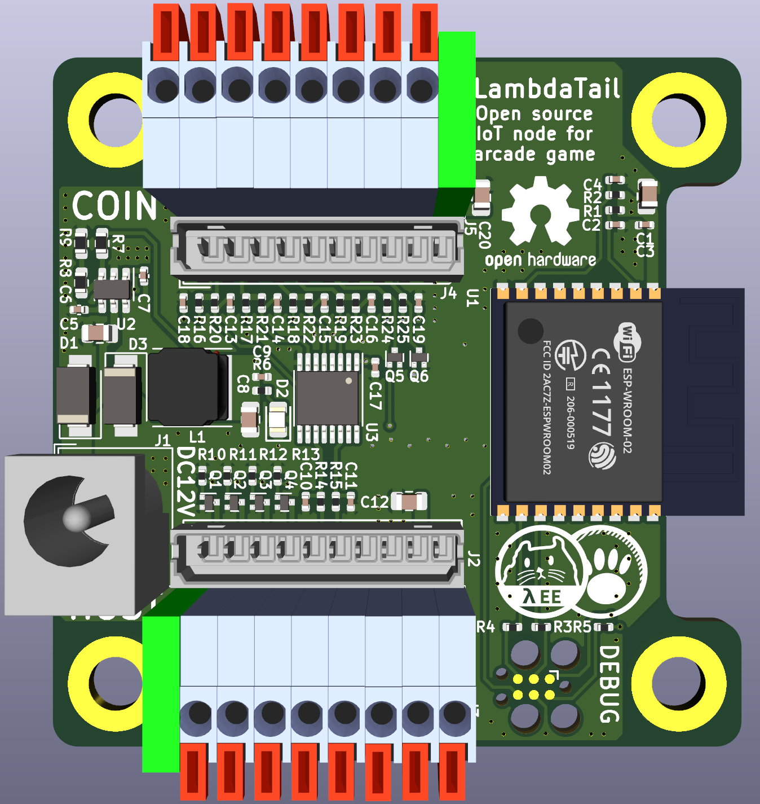

# LambdaTail PCB

**Open source IoT node for arcade game**

The goal of this repository is to make **Rust** + **RISC-V** + **Kicad6** based hardware.
And IoT node should be published to large number of devices. So aimed to manufacture with low-cost with less-BOM.

## How works
Monitor vend side device such as paper or coin acceptor at top connector. And then reflect or modify signal to bottom side's connector. 

While monitor vend side, send signal to server or process something.

## Simplified characteristics
| Parameter | Min | Typ | Max | Unit | 
| --- | --- | --- | --- | --- |
| Voltage Power Supply | 4.5 | 12  | 16  | V  |
| Current Consumption  | 50  | 100 | 400 | mA |

## Dependancy of footprint library
 - https://github.com/pmnxis/Lambda_KICAD5_LIB
 - https://github.com/espressif/kicad-libraries
 - Kicad 5.99 (Kicad 6) and Kicad 5 (legacy) default libraries.

## License
CERN-OHL-S-2.0 for Routing, Gerber, Schematic

Follow to original owner's license for footprint and related things.
